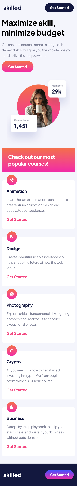
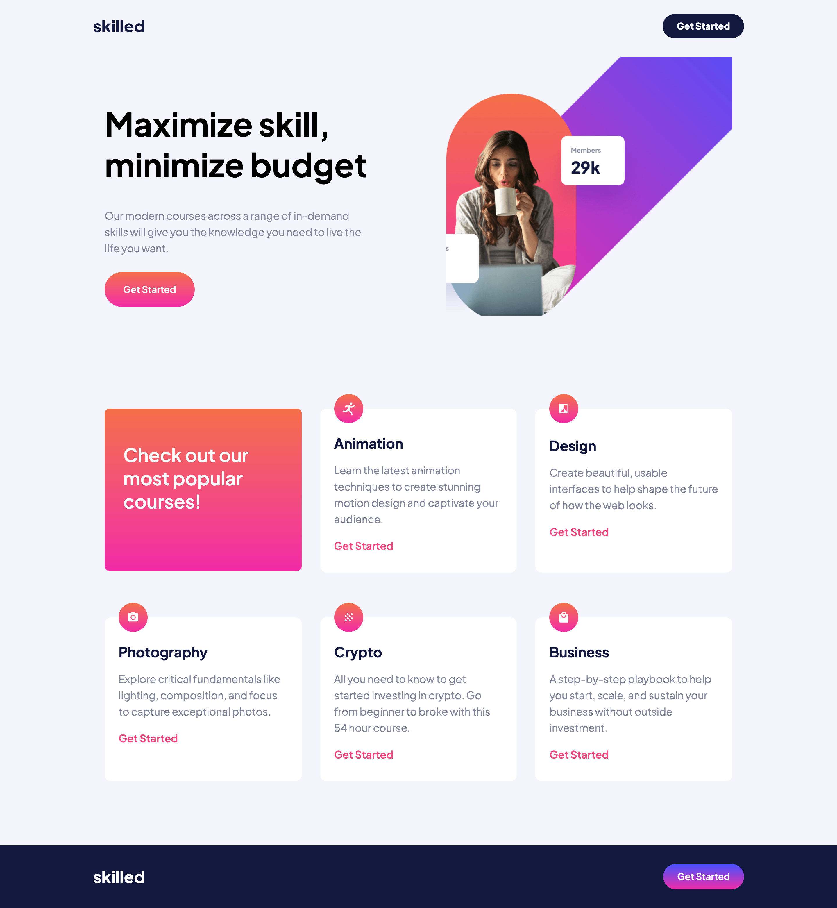

# Frontend Mentor - Skilled e-learning landing page solution

This is a solution to the [Skilled e-learning landing page challenge on Frontend Mentor](https://www.frontendmentor.io/challenges/skilled-elearning-landing-page-S1ObDrZ8q). Frontend Mentor challenges help you improve your coding skills by building realistic projects.

## Table of contents

- [Overview](#overview)
  - [The challenge](#the-challenge)
  - [Screenshot](#screenshot)
  - [Links](#links)
- [My process](#my-process)
  - [Built with](#built-with)
  - [What I learned](#what-i-learned)
  - [Continued development](#continued-development)
  - [Useful resources](#useful-resources)
- [Author](#author)
- [Acknowledgments](#acknowledgments)

## Overview

Hello, this is my first project with Frontend Mentor. I have experience with some HTML and CSS but am trying to improve my skills since they are a lot worse than other skills in this field.

### The challenge

Users should be able to:

- View the optimal layout depending on their device's screen size
- See hover states for interactive elements

### Screenshot

### Links

- Solution URL: [Add solution URL here](https://github.com/cwwittor/skilled-elearning-landing-page)
- Live Site URL: [Add live site URL here](https://cwwittor.github.io/skilled-elearning-landing-page/)

## My process

The steps I had went through in the process were as follows:

1. I had started with the html file and adding in all of what I thought would be needed in terms of blank divs, text, and elements.
2. From here I had defined the custom css variables
3. After defining the variables I had started with mobile layout first. My first thoughts were priorizing how I wanted certain components to be in terms of display type. Had settled on flex for a lot of the inside of elements and a grid layout for later when I would work on tablet/desktop. I had some problems here in terms of how I hadn't fully gotten it working before I switched to doing some things with tablet and how it shifted from mobile to tablet. Had to remove a few things but got looking fine for me.
4. From this I shifted to tablet. I had problems with setting up the image in the top section so that it was cut-off. Initially I had tried just using hidden overflow and translating out of frame. This had cut the image up though. I had then progressed to trying to use absolute positioning and making this a background image, but I had problems with both so ended up having to go with what didnt break my page when I hit the deadline.
5. From this I went to desktop where I realized from some assistance that I was overrelying on padding and margins, so I swapped a few things like the max-width of the webpage with what I had before, but I still think I used a good bit too much of padding.

### Built with

- Semantic HTML5 markup
- CSS custom properties
- Flexbox
- CSS Grid
- Mobile-first workflow
- [Styled Components](https://styled-components.com/) - For styles

**Note: These are just examples. Delete this note and replace the list above with your own choices**

### What I learned

I think the most valuable things I learned were as follows:

- Do not start working on another responsive design until fully finished with the first.
- Mobile is the best starting point and there should almost be barely any mobile media queries.
- Padding is not a be all solution for spacing and for things like page margin you have to think about how you want to set it up without padding.
- When working with multiple `<picture>` sources you will need to be direct in what media queries they break at, for example you will need to state a starting and ending bound for middle positioned ones.
- I should probably crop my images if it seems like the process will take too much time with code since it will also make the image be less load time.

### Continued development

I feel like with what I did this took me way too long to do in general, and I feel like my current abilities for this are a good bit weak. Some areas I want to improve upon:

- I want to get better with setting variables. I had set a lot at the start but had stopped using some since some variables on figma pages werent the same as the one in the stylesheet, so ended up using a lot of "imaginary numbers".
- I never finished being able to set the image up so it fits the project like it should. I want to be better at being able to problem solve for cases like this and understand how to do this without having to crop the picture.
- I want to stop overelying on padding as the first thought for spacing.

### Useful resources

The main resources I had used were w3schools and the raycast ai for simple questions about element names. I don't think I relied too heavily on either.

## Author

- Frontend Mentor - [@cwwittor](https://www.frontendmentor.io/profile/cwwittor)

## Acknowledgments

I would like to thank my coworker Andrew for helping me when I really hit a wall in a few cases, and just explaining things well. I really appreciate it since I acknowldge my current skills here need to be worked on.
